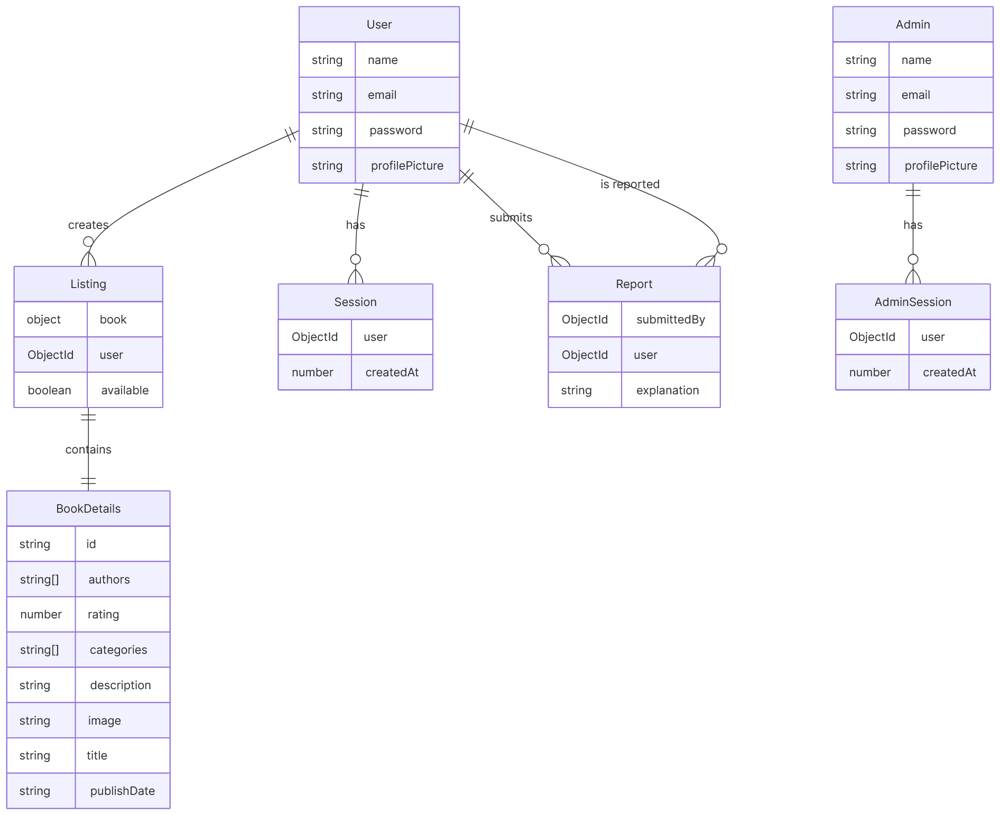

# Booklend Implementation Guide

This guide provides an overview of the implementation of Booklend's front- and back-end. This guide makes occasional references to links in the application, and it is assumed you have the main application running (see the Setup Guide for instructions). 

## The REST API

If you have the project running, we recommend that you view the API documentation [here](http://localhost:4000/docs). The remainder of this section focuses on the implementation and it will be easier to follow along with if you have some familiarity with the API.

### File Structure

```
back-end/src
|
├───database
├───middleware
├───routers
│   ├───admin
│   ├───analytics
│   ├───listing
│   ├───report
│   ├───search
│   └───user
├───types
└───util
```

- `database/` is where all of the Mongoose schema are defined and exported inside of a wrapper object named `db`. Throughout the rest of the code, database calls are made through this object. Where possible, we also take effort to minimize the number of database queries by making use of Mongoose's aggregation pipeline and employing best practices.
- `middleware/` is where our custom middleware is written. This includes authentication middleware for admin and regular users, request body parsing, handling file uploads (via [`multer`](https://www.npmjs.com/package/multer)), and error-logging.
- `types/` are where some generally-useful types and enums are defined. E.g., `Status` names each HTTP status code so that we can use names like `Status.OK` instead of numbers.
- `util/` is where general utility functions are implemented. E.g., some helper functions for formatting error responses or making requests to the Google Books API.
- `routers/` is where most of the business logic is implemented. All routers are aggregated in `routers/index.ts` and exported.

In `src/index.ts`, the actual server is configured and started.

### The Database Schema

The following is a diagram that represents our database schema.



### How We Define Routes

The API's endpoints/handlers are broadly grouped into routers. E.g., all `/user/*` endpoints are handled by the router defined in `routers/user`. Each router file contains every handler attached to it. E.g., a router file is structured like:

```ts
const userRouter = Router()

userRouter.get(
	"/login",
	middlewareOne,
	middlewareTwo,
	async (req, res) => {
		// handle the request.
	}
)

// ...

export default userRouter
```

This architecture is very straightforward and makes the code very easy to read and extend, though we recognize that it would not scale well if the project were to get very large. Nonetheless, it seemed appropriate for a project of this scope being developed by a small team.

You will also note that each major router has a corresponding `*Spec.ts` file. These specification files are used to define the OpenAPI spec for the program, but they do not affect the functionality in any way. You can safely ignore them.

### Runtime Type Validation

As mentioned before, we use Zod schema to define types that are to be sent and received by the API. [Zod](https://zod.dev/) is a library for defining schema that are compatible with Typescript which allow us to validate unknown objects at runtime. Our general pattern for parsing a request body is to use the `body` middleware in conjunction with a Zod schema. E.g.,

```ts
import z from "zod"
import body from "../middleware/body.js"

// ...

const CredentialsSchema = z.object({
	username: z.string(),
	password: z.string()
})

userRouter.post(
	"/login", 
	body(CredentialsSchema), // Sends 400 if validation fails.
	(req, res) => {
		// If we get this far, then we know that `req.body` matches the
		// credentials schema.
	}
)
```

### The Google Books API

In designing an app where we had to allow users to post that they have books available, we had two choices: we could require each user to upload details about the book when they post the listing and then store it in a database, or we could let the user search an existing database for a book and then select it. For a number of reasons, we chose the latter approach and decided to use the Google Books API. 

When a user searches for a book, the Booklend API fetches results from Google Books and formats them. When a user posts a listing, the client actually just submits a book ID, whose details are fetched and then stored in the Booklend database (this way we avoid making a call to Google Books every time we want to retrieve a listing).

This makes it so that each book listed is guaranteed to have a number of details, including a thumbnail image, the categories, the author, publication dates, etc, all without requiring our users to manually enter anything.

### Tests

The REST API has a comprehensive integration test suite implemented with [Bruno](https://www.usebruno.com/); however, running the tests requires using a specific development environment (the setup is described in the [project README](https://github.com/blobinaticuber/cosc360-group13/blob/main/README.md)).  If you have the project running, you can view the most recent test report [here](http://localhost:4000/public/test_report.html).

## The Front-End

The React client used for the front-end of Booklend is implemented in `front-end/src`. During the build process, this is compiled into an HTML document to be served from the back-end's `public/` folder as a static file. 

The following are also some general rules that the code in `front-end` conforms to:
- If a component imports some CSS, the `.css` file must match the `.tsx` file. E.g., `Form.tsx` imports `Form.css` and no other CSS.
- Each component has a default export that matches the name of the file. E.g., `Form.tsx` exports the component `Form`. Each component file exports only one component.
- Each component may exclusively communicate with the back-end via the `server` object, with the only exception being the `Form` component.

### File Structure

The `src/App.tsx` file includes some global configuration to set up the page. On page load, it makes an initial call to the server to check whether the client is authenticated as a user and/or an admin, which is then used to set the corresponding context providers. This component is also where the page router and routes are set up, which relies on the [`react-router-dom`](https://www.npmjs.com/package/react-router-dom) dependency.

The directory structure of `front-end/src` is described below.

```
front-end/src
|
├───assets
├───components
│   ├───account_page
│   ├───admin
│   ├───book_search
│   ├───create_listing
│   ├───forms
│   ├───layout
│   └───popup
├───hooks
├───pages
├───server
└───util
```

- The **`hooks`** directory contains custom hooks used throughout the pages. Currently, the only two hooks are for getting/setting the current admin/user (relying on the context providers in `App.tsx`).
- The **`pages`** directory contains the React components that represent pages. Page components are exclusively imported by `App.tsx` to be routed.
- The **`components`** directory defines components that may be used in various places. Some components naturally group together and are thus put into a directory for the sake of organization. E.g., `components/forms` includes both the `Form` and `TextInput` components, though there isn't anything that *requires* they be used together. 
- The **`server`** directory is where requests are defined to be made to/from the server, so that no component has to explicitly write fetch requests themselves.
- The **`utils`** directory contains a couple of generally-useful functions used in other parts of the program.
- The **`assets`** directory contains static assets (e.g., images) that the client relies on.

### Tools and Practices Used

Throughout the front-end implementation, we make use of some common tools and best practices. Namely,
- we use `useContext` to pass user information down, rather than prop drilling;
- we use `useRef` to track elements that should persist between renders;
- many of our components are highly reusable and take appropriate props, including children (some good examples of this are `SearchBar`, `Form`, and `TextInput`);
- we keep CSS selectors very specific to avoid accidental name collisions;
- as with the back-end, the front-end uses TypeScript and takes great efforts to maintain type-safety.
